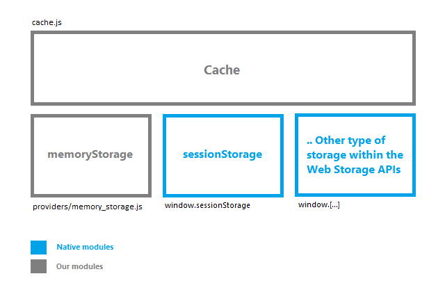

Cache (Adapter)
===============

The "Cache" module is an adapter that summarizes the work with the different APIs of web storage, it is designed to work with any of these APIs, at this time we are only working with two of them: "sessionStorage" (native, html5 web storage https://developer.mozilla.org/en-US/docs/Web/API/Window/sessionStorage) and "memoryStorage" (non native, it is defined within our utils).



The "Cache" module implements the following methods: has, set, get, remove, clean.

###Cache.has 
Receives a "Key", then check if it exists, the result can be true, false or null in case of failure.
```js
window._cache.set("my-key", {});
// 1
window._cache.has("my-key");
// true
```

###Cache.set 
Receives a "Key" and "Value", then stores the value with the corresponding key, the result can be the new length of the storage provider or null in case of failure.
```js
window._cache.set("my-new-key", myNewValue);
// 2
```

###Cache.get 
Receives a "Key", then the value obtained as the key, the result can be stored value or null in case of failure.
```js
window._cache.get("my-key");
// {}
```

###Cache.remove
Remove an item stored in our storage provider, the result can be the new length of the storage provider or null in case of failure.
```js
window._cache.remove("my-key");
// 1
```

###Cache.clean 
Removes all items stored in our storage provider, the result can be the new length of the storage provider or null in case of failure.
```js
window._cache.clean();
// 0
```

Memory Storage (Provider)
=========================

The "Memory Storage" module implements the main features presented in storage web interface such as: length, getItem, key, setItem, removeItem, clear. Please review this documentation https://developer.mozilla.org/en-US/docs/Web/API/Storage.