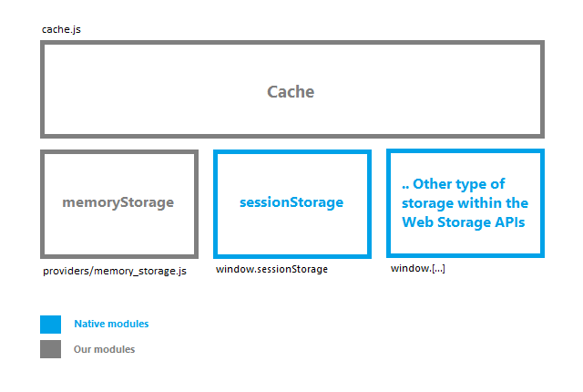

Cache (Adapter)
===============

El modulo “Cache” es un adaptador que ameniza el trabajo con las diferentes APIs de web storage, está pensado para trabajar con cualquiera de estas APIs, por el momento solo estamos trabajando con dos:  “sessionStorage” (native, html5 web storage https://developer.mozilla.org/en-US/docs/Web/API/Window/sessionStorage) y “memoryStorage” (no es nativo, se encuentra definido dentro de nuestros providers).



El modulo “Cache” implementa los siguientes métodos: has, set, get, remove, clean.
 
###Cache.has
Recibe una “Key”, luego verifica si esta existe, su resultado puede ser “true” o “false”.
```
window._cache.set("my-key", {});
// 1
window._cache.has("my-key");
// true
```

###Cache.set
Recibe una “Key” y un “Value”, luego almacena el valor con la clave correspondiente, su resultado puede ser el nuevo length del storage provider o null en caso de fallar.
```
window._cache.set("my-new-key", myNewValue);
// 2
```

###Cache.get 
Recibe una “Key”,  luego obtiene el valor según la clave, su resultado puede ser cualquiera según lo almacenado o null en caso de fallar. 
```
window._cache.get("my-key");
// {}
```

###Cache.remove 
Elimina un elemento almacenado en nuestro storage provider, su resultado puede ser el nuevo length del storage provider o null en caso de fallar.
```
window._cache.remove("my-key");
// 1
```

###Cache.clean 
Elimina todo los elementos almacenados en nuestro storage provider, su resultado puede ser el nuevo length del storage provider o null en caso de fallar.
```
window._cache.clean();
// 0
```

Memory Storage (Provider)
=========================

El modulo “Memory Storage” implementa los principales características que presenta la interfaz propuesta para cualquier tipo de web storage, estas son: length, getItem, key, setItem, removeItem, clear. Por favor revisar esta documentación https://developer.mozilla.org/en-US/docs/Web/API/Storage.